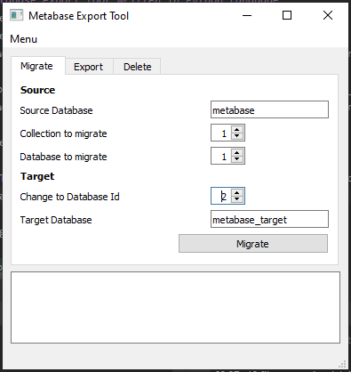

---


# Metabase Export Tool

**Overview**

The Metabase Export Tool is a Python application for exporting, importing, and managing Metabase databases and collections. It provides functionalities for migrating databases, exporting data, and managing collections.



**Table of Contents**

- [Prerequisites](#prerequisites)
- [Installation](#installation)
    - [On Windows](#on-windows)
    - [On Ubuntu](#on-ubuntu)
- [Configuration](#configuration)
- [Running the Tool](#running-the-tool)
- [Troubleshooting](#troubleshooting)

**Prerequisites**

- **Python 3.x**: Ensure Python 3.x is installed on your system.
- **pip**: The Python package installer.
- **Virtualenv**: For creating isolated Python environments.

**Installation**

### On Windows

1. **Install Python 3.x**

   Download and install Python 3.x from the [official Python website](https://www.python.org/downloads/). During installation, ensure you check the option to add Python to your system PATH.

2. **Install Virtualenv**

   Open Command Prompt and run:
   ```bash
   pip install virtualenv
   ```

3. **Create and Activate Virtual Environment**

   Navigate to your project directory and create a virtual environment:
   ```bash
   python -m venv myenv
   ```

   To activate the virtual environment:
   ```bash
   myenv\Scripts\activate
   ```

4. **Install Dependencies**

   Navigate to the directory containing `requirements.txt` and install the required packages:
   ```bash
   pip install -r requirements.txt
   ```

   If you encounter errors regarding missing packages (e.g., `playhouse`), manually install the required packages or update `requirements.txt`.

### On Ubuntu

1. **Install Python 3.x and Virtualenv**

   Install Python 3.x and Virtualenv using:
   ```bash
   sudo apt update
   sudo apt install python3 python3-venv python3-pip
   ```

2. **Create and Activate Virtual Environment**

   Navigate to your project directory and create a virtual environment:
   ```bash
   python3 -m venv myenv
   ```

   To activate the virtual environment:
   ```bash
   source myenv/bin/activate
   ```

3. **Install Dependencies**

   Navigate to the directory containing `requirements.txt` and install the required packages:
   ```bash
   pip install -r requirements.txt
   ```

   If you encounter errors regarding missing packages (e.g., `playhouse`), manually install the required packages or update `requirements.txt`.

**Configuration**

1. **Configuration File**

   Ensure that the configuration file `config_db.yml` is properly set up according to your environment and requirements. This file is used by the tool to connect to and manage Metabase databases.

**Running the Tool**

1. **Start the Tool**

   After setting up your environment and installing dependencies, you can run the tool using:
   ```bash
   python MetabaseExportTool.py
   ```

**Troubleshooting**

- **Common Errors**

    - **ModuleNotFoundError**: If you encounter errors related to missing modules, ensure all required packages are installed. You may need to manually install certain packages if they are not listed in `requirements.txt`.

    - **Qt Platform Plugin Issues**: On Ubuntu, ensure the necessary Qt libraries are installed. You may need to install `libxcb1` and other dependencies.